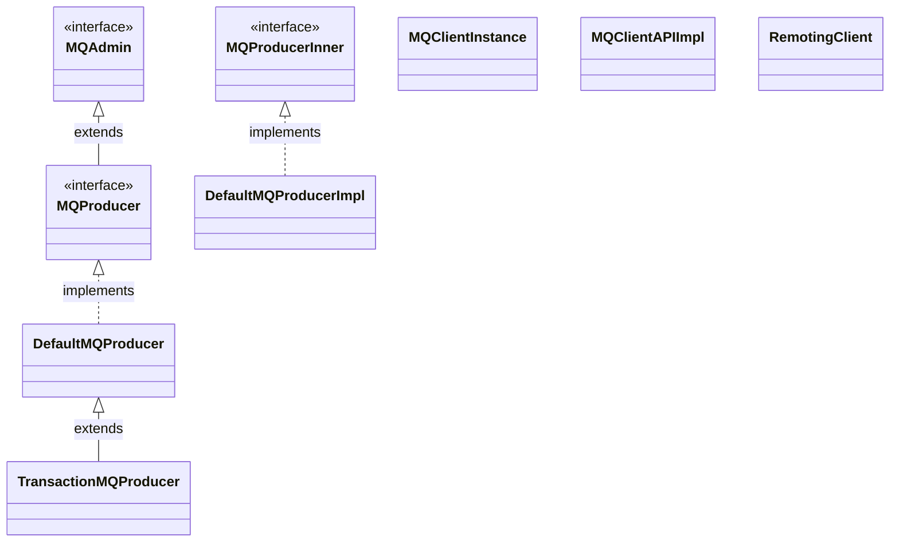

```mermaid
classDiagram
    
    class MQAdmin {
        <<interface>>
    }

    class MQProducer {
        <<interface>>
    }
    
    class DefaultMQProducer {
    }
    
    class TransactionMQProducer {
    }
    
    class MQProducerInner {
        <<interface>>
    }
    
    class DefaultMQProducerImpl {
    }
    
    class MQClientInstance {
    }
    
    class MQClientAPIImpl {
    }
    
    class RemotingClient {
    }

    MQAdmin <|-- MQProducer : extends
    MQProducer <|.. DefaultMQProducer : implements
    DefaultMQProducer <|-- TransactionMQProducer : extends

    MQProducerInner <|.. DefaultMQProducerImpl: implements
```